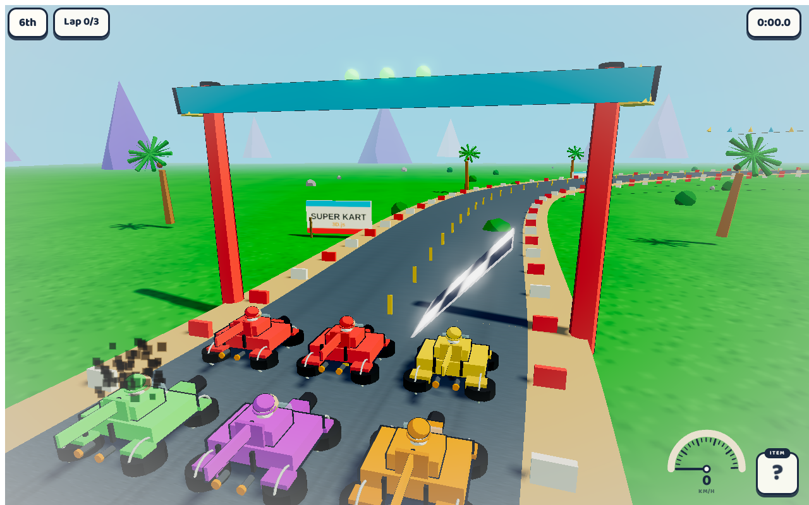
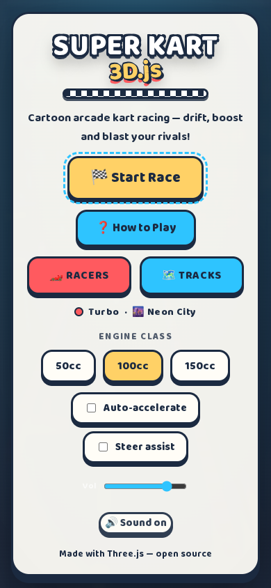

# Super Kart 3D.js

> A cartoon arcade kart racer with **AAA-grade visuals**, power-ups and
> procedural audio — built on Three.js and playable right in the browser
> with **keyboard or touch**.

<p align="center">
  <a href="https://fecolinhares.github.io/super-kart-3djs/"></a>
  <a href="https://github.com/fecolinhares/super-kart-3djs/actions"></a>
  <a href="LICENSE"></a>
</p>

<p align="center">
  
  
</p>

## 🎮 Play online

**https://fecolinhares.github.io/super-kart-3djs/** — or run it locally (see [Running](#-running)).

## 🏁 What is this?

A fast, juicy **cartoon kart racer** in the spirit of the genre's best: drift
around banked curves, smash **item boxes** and use the power-up you get —
mushroom boost, homing shell, banana trap, invincibility star or the dreaded
lightning bolt — to fight your way from 6th to 1st across **3 laps**.

Every visual layer targets a **AAA** bar: toon-shaded materials with rim
lighting, saturated palette, post-processing (bloom + color grade + vignette),
particles, squash & stretch, camera shake, procedural sky, animated clouds and
crowd. All audio — engine loops, SFX and the music playlist — is synthesized
in real time with the Web Audio API (zero asset files).

## 🕹️ How to Play

Beat **5 AI rivals** over **3 laps**. Drive through item boxes, then use what
you get. Drift through corners to charge a **mini-boost**.

| Action | Keyboard | Touch (mobile) |
|--------|----------|----------------|
| Steer | `←` / `→` or `A` / `D` | `◀` / `▶` buttons |
| Accelerate | `↑` / `W` | Auto-accelerate |
| Brake / reverse | `↓` / `S` | — |
| Drift | `Shift` + steer | `⟳` button while steering |
| Use item | `Space` | `🎁 ITEM` button |
| Pause | `P` or `Esc` | — |
| Restart | `R` | — |

> **Input isolation**: on desktop only keyboard works (no touch buttons); on
> mobile only the touch buttons control the kart. The modes never mix.

## ✨ Features

- **6 karts** with distinct colors, toon materials, animated driver, squash &
  stretch and drifting with mini-boost (Mario Kart style)
- **Full item arsenal**: 🍄 Mushroom (speed boost), 🐢 Green Shell (straight
  shot), 🐢 Red Shell (homing), 🍌 Banana (trap), ⭐ Star (invincible), ⚡
  Lightning (shrink rivals)
- **5 AI rivals** with waypoint following, rubber-banding and item usage
- **Banked, elevated cartoon track** with procedural toon materials, animated
  clouds, water, palm trees, mountains and crowd
- **Post-processing** — bloom, saturation/contrast grade and vignette
- **Procedural audio** — engine pitch, drift, pickups, explosions and a
  dynamic lo-fi racing playlist (Web Audio, zero files)
- **Responsive** — desktop keyboard and mobile touch layouts
- **`?demo` mode** — cinematic autopilot camera used for screenshots/QA

## 🚀 Running

```bash
npm install
npm run dev        # http://localhost:3457
```

Production build:

```bash
npm run build      # outputs to dist/
npm run preview    # serve the production build
```

> `npm ci` requires a package-lock.json (committed).

## 🗂️ Docs

- [ARCHITECTURE.md](docs/ARCHITECTURE.md) — module contracts, file layout, quality gates
- [DESIGN.md](docs/DESIGN.md) — visual direction & AAA quality bar

## 🤝 Contributing

See [CONTRIBUTING.md](CONTRIBUTING.md) and our [Code of Conduct](CODE_OF_CONDUCT.md).
Found a security issue? Read [SECURITY.md](SECURITY.md).

## 📄 License

[MIT](LICENSE) © 2026 Feco Linhares
