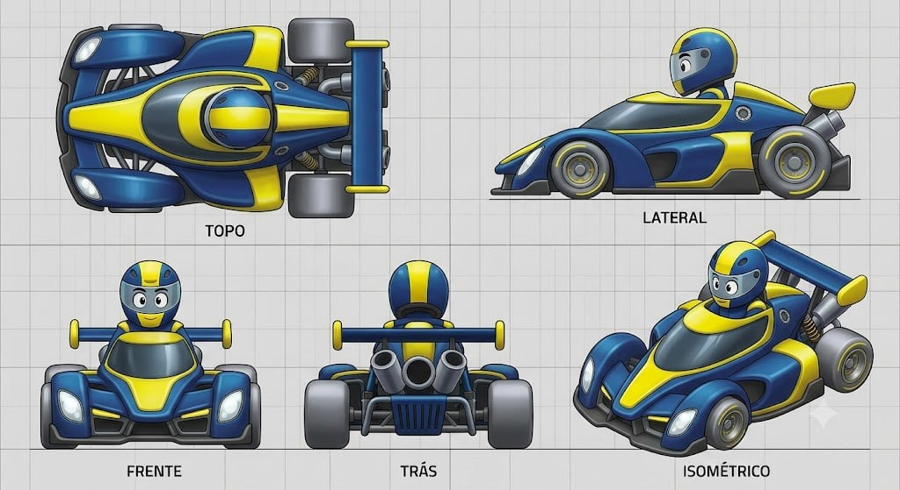

# Aero-Dyno

## Descrição

Design que adapta a silhueta de um protótipo de Le Mans/LMP1 ao mundo cartunesco. O kart é extremamente baixo, longo e aerodinâmico, parecendo uma bolha de velocidade sobre o asfalto. A cartunização está nas formas fluidas e arredondadas, na cabine bolha integrada e na grande asa traseira com leitura de “asa de tubarão”. Os pneus são finos e lisos, reforçando a ideia de velocidade máxima.

## Vistas disponíveis

A imagem contém cinco painéis rotulados:

1. **Topo:** mostra o corpo longo, a cabine central integrada, os side pods fluidos, os faróis dianteiros, as rodas finas e o conjunto traseiro com motor/escapes e asa transversal.
2. **Lateral:** mostra a altura extremamente baixa, o nariz longo, a cabine bolha, os side pods esculpidos, os pneus finos, o piloto baixo e a asa traseira elevada.
3. **Frente:** mostra a frente larga com dois faróis grandes, nariz central amarelo, entradas/grades inferiores e as rodas dianteiras parcialmente carenadas.
4. **Trás:** mostra a asa transversal, suportes traseiros, módulo central circular, dois escapes inclinados e a grade/difusor inferior.
5. **Isométrico:** confirma a leitura de protótipo de endurance cartunesco, com carroceria fluida, cockpit integrado, side pods, rodas finas e aero traseira dominante.

## Forma e proporção a preservar

- Silhueta muito baixa, longa e larga, com leitura de velocidade mesmo parado.
- Nariz frontal comprido e afilado, sem bumper tubular volumoso de kart tradicional.
- Cabine bolha totalmente integrada à carroceria, com transição suave para o capô e os side pods.
- Side pods fluidos, arredondados e carenados, formando uma cintura aerodinâmica contínua.
- Dois faróis dianteiros grandes, ovais e embutidos nas extremidades frontais.
- Rodas/pneus finos, lisos e visualmente rápidos; não usar pneus largos de kart sem novo briefing.
- Piloto baixo, encaixado na cabine, com capacete visível acima da linha da carroceria.
- Grande asa traseira transversal, com suportes verticais e leitura de “asa de tubarão”.
- Módulo traseiro exposto com saída circular central, dois escapes inclinados e grade/difusor inferior.

## Cor e material

### Customização permitida

As regiões **amarela** e **azul** são canais potenciais de customização de cor. A geometria, as divisões de painéis e os limites dessas regiões devem permanecer fiéis ao concept.

### Elementos que permanecem fiéis

- Pneus: pretos, finos, lisos e com material emborrachado fosco.
- Cabine/visor: escuro, transparente ou fumê, integrado à carroceria.
- Faróis: claros, luminosos e ovais, embutidos na frente.
- Chassi, suportes, suspensão e ferragens: cinza metálico escuro/prata.
- Motor, módulo traseiro, escapes e grade: metálicos/cinzas, preservando a leitura mecânica.
- Asa traseira: estrutura escura/azul conforme o concept, com bordas e suportes legíveis.
- Piloto: capacete e rosto/visor expressivo devem manter a leitura cartunesca do concept.
- Grid, textos dos painéis e linhas de chão não fazem parte do asset.

## Notas de modelagem

- Esta ficha é referência visual; não é autorização para iniciar modelagem.
- Não inferir dimensões exatas a partir do grid sem um briefing de escala.
- Amarelo e azul representam regiões de materialização/customização, não materiais finais obrigatórios.
- A cabine, a linha inferior do nariz, os side pods e a asa traseira devem ser validados simultaneamente nas cinco vistas.
- A asa “de tubarão” é elemento de identidade principal e não deve ser reduzida a um aerofólio genérico.

## Arquivo-fonte

- `assets/aero-dyno.jpg`
- Arquivo recebido: `img_e39a23e62dad.jpg`
