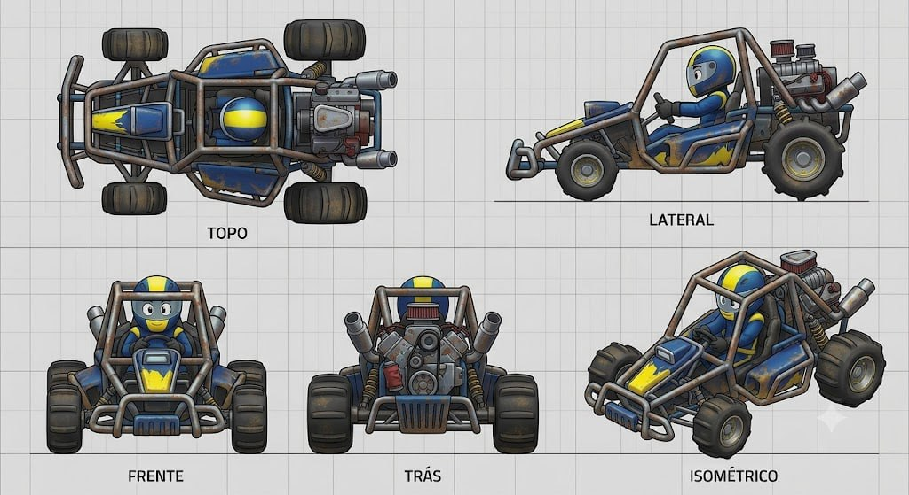

# Desert Drifter

## Descrição

Buggy de dunas cartunesco para cenários desérticos e caóticos. O veículo usa uma gaiola de proteção comicamente grossa e exposta, suspensão de braços longos, amortecedores gigantes visíveis em todas as rodas e um motor traseiro maciço centralizado dentro da gaiola. Filtros de ar elevados protegem o motor da poeira. Os pneus são largos e têm rastros de pá para areia.

## Vistas disponíveis

A imagem contém cinco painéis rotulados:

1. **Topo:** mostra a gaiola perimetral, cockpit/piloto, nariz, quatro pneus largos, braços de suspensão, amortecedores, motor traseiro e filtros elevados.
2. **Lateral:** mostra o perfil de buggy, gaiola grossa, cockpit aberto, braço longo dianteiro, amortecedor exposto, pneu dianteiro, motor traseiro e pneus drag/sand.
3. **Frente:** mostra a gaiola envolvendo piloto e nariz, bumper tubular, suspensão dianteira, amortecedores laterais, pneus largos e placa/grade frontal.
4. **Trás:** mostra o motor central, filtros elevados, dois escapes, amortecedores traseiros, grade inferior, barra e pneus traseiros largos.
5. **Isométrico:** confirma a leitura de buggy de dunas, com gaiola dominante, longo curso visível, motor traseiro elevado e pneus de areia.

## Forma e proporção a preservar

- Gaiola tubular extremamente grossa, exposta e dominante na silhueta.
- Cockpit aberto dentro da gaiola, com piloto visível.
- Braços de suspensão longos e desproporcionais.
- Amortecedores gigantes visíveis em todas as rodas, com molas/coilovers legíveis.
- Motor traseiro grande e centralizado dentro/atrás da gaiola.
- Filtros de ar elevados acima do motor para leitura de veículo de deserto.
- Bumper tubular frontal e placa/grade inferior.
- Pneus largos, altos e com tread em pás/blocos para areia; não substituir por pneus lisos.
- Dois escapes traseiros inclinados, além de suportes, barras e ferragens expostos.

## Cor e material

### Customização permitida

As regiões **amarela** e **azul** são canais potenciais de customização de cor. A gaiola, os painéis, os limites de pintura e os componentes mecânicos devem permanecer fiéis ao concept.

### Elementos que permanecem fiéis

- Pneus: pretos, largos e com tread profundo em pás/blocos.
- Gaiola, braços, molas e ferragens: metal marrom/cinza escuro, com leitura robusta e exposta.
- Motor e filtros: metal escuro/prata, com componentes elevados e visíveis.
- Escapes: tubos metálicos prateados/escuros.
- Cockpit e assento: escuros, com piloto cartunesco visível.
- Painéis: metálicos desgastados, com textura de uso em ambiente desértico.
- Grid, textos dos painéis e linhas de chão não fazem parte do asset.

## Notas de modelagem

- Esta ficha é referência visual; não é autorização para iniciar modelagem.
- Não inferir dimensões exatas a partir do grid sem um briefing de escala.
- Não esconder a gaiola, os amortecedores ou os braços longos; eles são a identidade do buggy.
- Não trocar o tread de areia por pneus de kart convencionais.
- O conjunto gaiola → suspensão de longo curso → motor/filtros elevados → pneus de pá deve funcionar nas cinco vistas.

## Arquivo-fonte

- `assets/desert-drifter.jpg`
- Arquivo recebido: `img_8fb07eec985b.jpg`
