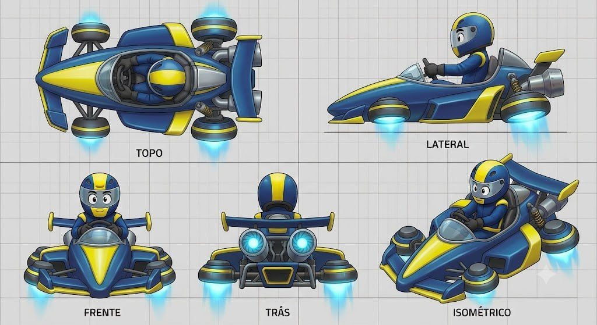

# Hover Drifter

## Descrição

Kart futurista inspirado em karts anti-gravidade de MK8. As rodas convencionais são substituídas por emissores magnéticos redondos e brilhantes, com propulsores laterais exagerados. O corpo é liso e curvo, a cabine/cockpit é bolha e o veículo parece flutuar sobre o asfalto através de brilho ciano.

## Vistas disponíveis

A imagem contém cinco painéis rotulados:

1. **Topo:** mostra o nariz central, cockpit/cabine, piloto, quatro emissores redondos, braços laterais, asas/barras e módulo traseiro.
2. **Lateral:** mostra o corpo baixo e curvo, cockpit com pequeno para-brisa/bolha, piloto, emissor dianteiro e traseiro com brilho ciano, suspensão/haste e bocal traseiro.
3. **Frente:** mostra nariz pontudo amarelo, cockpit e piloto, dois emissores frontais, barras laterais e efeitos luminosos de levitação.
4. **Trás:** mostra asa/barra traseira, dois grandes emissores com brilho ciano, luzes centrais e bocal/módulo traseiro.
5. **Isométrico:** confirma a leitura de veículo flutuante, com corpo liso, quatro pods magnéticos, cockpit bolha e aero traseira.

## Forma e proporção a preservar

- Corpo central liso, baixo, curvo e aerodinâmico.
- Nariz pontudo e limpo, sem bumper volumoso.
- Quatro emissores magnéticos redondos substituem rodas; não adicionar pneus convencionais.
- Emissores têm proporção exagerada, anéis escuros/amarelos e núcleo/propulsão ciano luminoso.
- Propulsores laterais são grandes e claramente separados do corpo central.
- Cockpit/cabine bolha com piloto visível e perfil baixo.
- Barras/asas laterais e traseiras finas, com pontas amarelas.
- Módulo traseiro com bocal, luzes e superfícies de aero.

## Cor e material

### Customização permitida

Amarelo e azul são canais potenciais de customização. A forma dos emissores, limites dos painéis, asas e carroceria deve permanecer fiel.

### Elementos que permanecem fiéis

- Emissores: carcaça escura/metálica, anéis definidos e brilho ciano intenso na parte inferior.
- Efeito de levitação: luz/energia ciano sob cada emissor; não tratar como simples roda com neon.
- Cockpit/para-brisa: transparente/fumê.
- Chassi, hastes e suspensão: cinza metálico escuro.
- Bocal traseiro e módulos mecânicos: metálicos, com luzes claras/ciano.
- Piloto: traje, capacete e olhos expressivos cartunescos.
- Grid, textos dos painéis e linhas de chão não fazem parte do asset.

## Notas de modelagem

- Esta ficha é referência visual; não é autorização para iniciar modelagem.
- Não inferir dimensões exatas a partir do grid sem um briefing de escala.
- Não substituir emissores por rodas nem remover o brilho ciano de levitação.
- A identidade depende de corpo liso → quatro pods magnéticos → cockpit bolha → efeitos ciano.

## Arquivo-fonte

- `assets/hover-drifter.jpg`
- Arquivo recebido: `img_3438fd765143.jpg`
