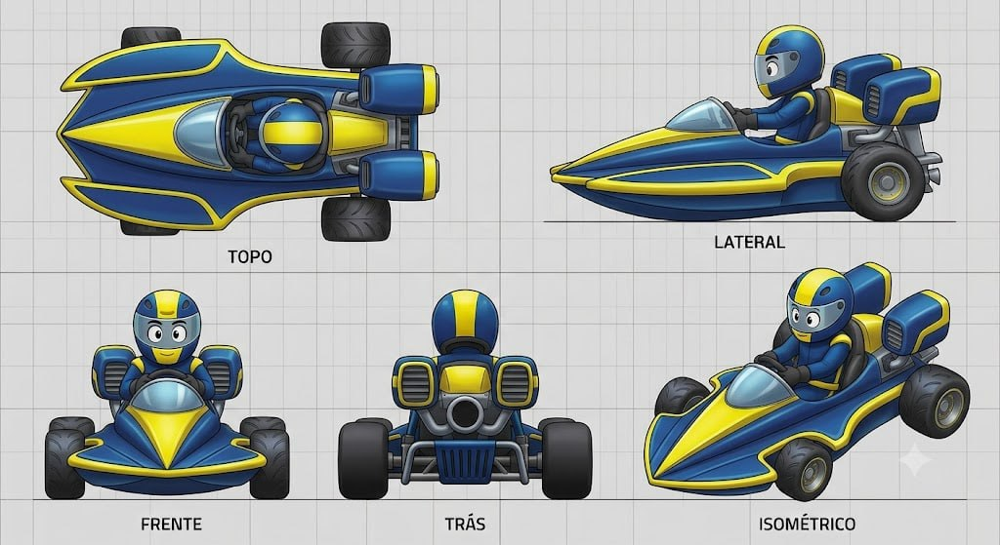

# Hydro-Blaster

## Descrição

Kart que adapta uma lancha de alta velocidade/offshore racing boat às pistas. O corpo é um casco pontudo, afilado e hidrodinâmico, com propulsores aquáticos falsos e canos elevados que lembram turbinas de lancha. O cockpit bolha é fechado e aerodinâmico. Os pneus são lisos e parecem flutuar sobre o asfalto.

## Vistas disponíveis

A imagem contém cinco painéis rotulados:

1. **Topo:** mostra o casco longo e afilado, cockpit bolha fechado, piloto central, side pods fluidos, rodas, propulsores/turbinas traseiras e canais laterais amarelos.
2. **Lateral:** mostra o perfil de lancha, nariz pontudo, cabine fechada, piloto, side pod hidrodinâmico, pneu traseiro liso e turbina/cano elevado atrás do cockpit.
3. **Frente:** mostra o nariz em cunha, painel amarelo central, cockpit bolha, piloto, rodas dianteiras e volumes laterais azuis/amarelos.
4. **Trás:** mostra dois módulos elevados de propulsão/turbina, saída circular central, grade inferior, tubos e rodas traseiras.
5. **Isométrico:** confirma a leitura de casco de lancha sobre rodas, cockpit protegido, side pods fluidos e propulsores traseiros.

## Forma e proporção a preservar

- Casco central longo, baixo, afilado e pontudo, com leitura de lancha offshore.
- Nariz em cunha, estreito na ponta e mais largo junto ao cockpit.
- Cockpit bolha fechado, transparente/fumê e integrado ao casco.
- Piloto protegido dentro da cabine; não transformar em cockpit aberto.
- Side pods longos, fluidos e aerodinâmicos.
- Rodas/pneus lisos, visualmente leves e com sensação de flutuação.
- Dois módulos traseiros elevados, com forma de propulsor/turbina de lancha.
- Tubos/canos traseiros visíveis e elevados acima da linha inferior do casco.
- Traseira com saída circular central, grade inferior e suportes mecânicos discretos.

## Cor e material

### Customização permitida

As regiões **amarela** e **azul** são canais potenciais de customização de cor. A geometria, a separação dos painéis e os limites dessas regiões devem permanecer fiéis ao concept.

### Elementos que permanecem fiéis

- Pneus: pretos, lisos e com material emborrachado fosco.
- Cockpit bolha: transparente/fumê, com brilho controlado.
- Propulsores e canos: cinza/prata metálico, com aberturas e volumes cilíndricos legíveis.
- Grade inferior e ferragens: cinza escuro/metálico.
- Piloto: macacão, capacete e rosto/visor com leitura cartunesca; manter a proteção da cabine.
- Chassi e suportes: escuros/metálicos e subordinados ao casco.
- Grid, textos dos painéis e linhas de chão não fazem parte do asset.

## Notas de modelagem

- Esta ficha é referência visual; não é autorização para iniciar modelagem.
- Não inferir dimensões exatas a partir do grid sem um briefing de escala.
- Amarelo e azul representam regiões de materialização/customização, não materiais finais obrigatórios.
- A identidade depende da relação casco de lancha → cockpit fechado → rodas lisas → turbinas traseiras elevadas.
- Não substituir o cockpit bolha fechado por uma cabine aberta nem transformar os propulsores em um motor convencional exposto.

## Arquivo-fonte

- `assets/hydro-blaster.jpg`
- Arquivo recebido: `img_fae3f44c9ffd.jpg`
