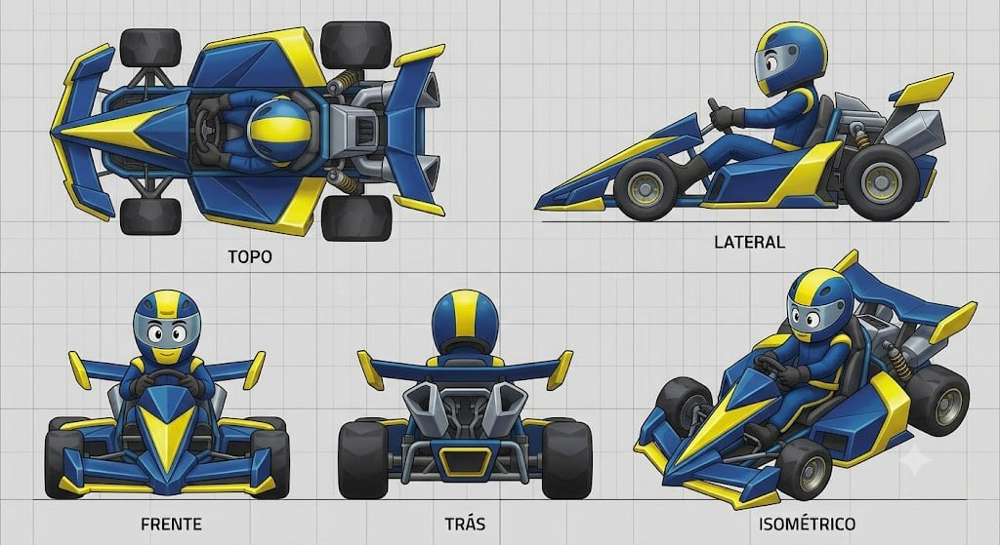

# Hyper-Angular

## Descrição

Kart cartunesco de ângulos extremos e agressivos, inspirado na estética exagerada de Sonic Racing. A frente é pontuda, o chassi é baixo e longo, e o motor traseiro é maciço e facetado. A proposta transborda velocidade visual através de planos, pontas e mudanças bruscas de direção.

## Vistas disponíveis

A imagem contém cinco painéis rotulados:

1. **Topo:** mostra o nariz pontudo, chassi central facetado, cockpit/piloto, rodas, braços de suspensão, asas/barras dianteiras e traseiras e motor traseiro angular.
2. **Lateral:** mostra a linha extremamente baixa e longa, nariz em cunha, piloto sentado, side pod angular, rodas, suspensão e módulo traseiro facetado com escapes.
3. **Frente:** mostra o nariz central pontudo, faixa/painel frontal amarelo, cockpit/piloto, rodas dianteiras e barras laterais elevadas.
4. **Trás:** mostra o motor traseiro maciço, duas saídas/escapes angulares, grade inferior, barra transversal e pneus traseiros.
5. **Isométrico:** confirma a leitura de velocidade agressiva, com carroceria em planos, asas/barras cortantes e mecânica traseira robusta.

## Forma e proporção a preservar

- Nariz muito pontudo, baixo e agressivo.
- Chassi central longo e baixo, com facetas e mudanças claras de plano.
- Carroceria não deve ser suavizada até virar uma bolha; os ângulos são a identidade principal.
- Cockpit aberto/baixo com piloto visível e estrutura angular ao redor.
- Side pods e fenders com quinas, pontas e superfícies inclinadas.
- Rodas expostas o suficiente para manter a leitura esportiva.
- Braços de suspensão, asas e barras com perfis finos, inclinados e agressivos.
- Motor traseiro grande, centralizado e facetado.
- Escapes/saídas traseiras angulares, grade inferior e suportes mecânicos visíveis.
- Piloto estilizado sentado, com capacete expressivo.

## Cor e material

### Customização permitida

As regiões **amarela** e **azul** são canais potenciais de customização de cor. A geometria, os limites dos painéis e a separação entre planos devem permanecer fiéis ao concept.

### Elementos que permanecem fiéis

- Pneus: pretos, com material emborrachado fosco.
- Motor traseiro, escapes, suspensão e ferragens: cinza/prata metálico escuro.
- Grade traseira e componentes internos: escuros/metálicos.
- Cockpit e assento: escuros, com piloto claramente visível.
- Capacete/visor e rosto do piloto: preservar a leitura cartunesca.
- Faróis/detalhes luminosos, quando presentes, devem permanecer claros e embutidos.
- Grid, textos dos painéis e linhas de chão não fazem parte do asset.

## Notas de modelagem

- Esta ficha é referência visual; não é autorização para iniciar modelagem.
- Não inferir dimensões exatas a partir do grid sem um briefing de escala.
- Amarelo e azul representam regiões de materialização/customização, não materiais finais obrigatórios.
- A identidade depende de nariz pontudo → chassi baixo/longo → facetas agressivas → motor traseiro maciço.
- Não arredondar as superfícies até remover os planos angulares; a agressividade geométrica é intencional.

## Arquivo-fonte

- `assets/hyper-angular.jpg`
- Arquivo recebido: `img_a62613005584.jpg`
