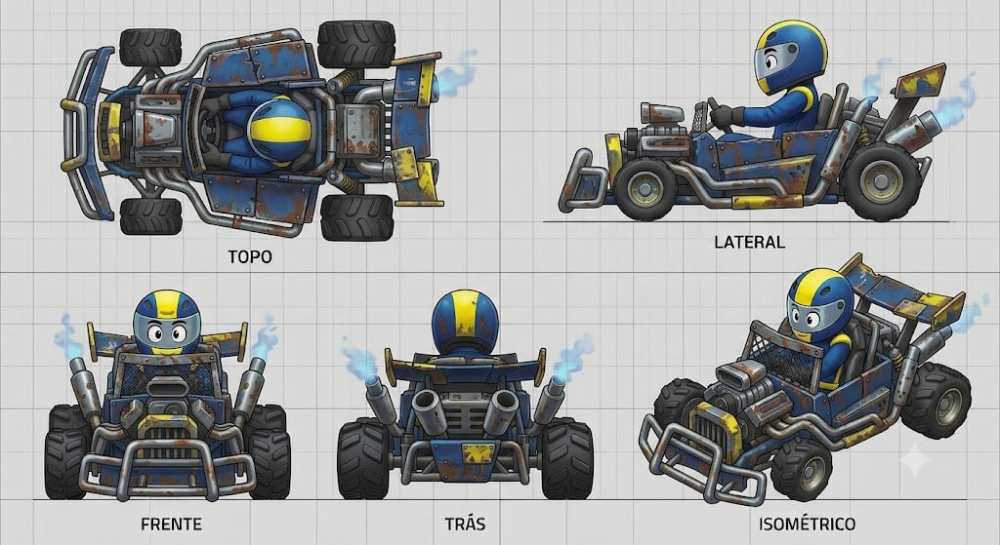

# Nitro Scrapper

## Descrição

Kart que abraça o caos e a estética de sucata montada de Crash Team Racing. É composto por tubos grossos expostos, placas de metal rebitadas e peças aparentemente canibalizadas de outros veículos. O motor é gigante e exposto, os escapes soltam fumaça azulada e os pneus têm rastro agressivo de trator.

## Vistas disponíveis

A imagem contém cinco painéis rotulados:

1. **Topo:** mostra tubos perimetrais, placas rebitadas, cockpit/piloto, motor exposto, pneus de trator, bumper frontal, barras e escapes traseiros.
2. **Lateral:** mostra a estrutura de canos, placa lateral azul enferrujada, motor alto e exposto, cockpit aberto, suspensão, tubos laterais, pneus traseiros e escapes com fumaça.
3. **Frente:** mostra bumper tubular grande, grade/placa frontal, motor central, dois escapes laterais, rodas com tread agressivo e piloto.
4. **Trás:** mostra placa traseira, grade/motor, quatro canos/escapes inclinados, fumaça azulada, barras e pneus traseiros largos.
5. **Isométrico:** confirma a montagem assimétrica de sucata, com placas, tubos, motor, escapamentos, piloto e pneus de trator.

## Forma e proporção a preservar

- Mistura deliberadamente desajeitada de peças, sem aparência de carroceria manufaturada limpa.
- Tubos grossos expostos formando bumper, laterais, gaiola e suportes.
- Placas de metal irregulares, sobrepostas e rebitadas.
- Motor muito grande, elevado e visível no centro/frente.
- Cockpit aberto e piloto exposto entre a estrutura.
- Pneus grandes com tread profundo e agressivo de trator.
- Suspensão e ferragens visíveis.
- Quatro escapes/canos traseiros inclinados, com fumaça azulada.
- Peças canibalizadas — caixas, placas, grades e módulos incompatíveis — devem parecer montadas, não uniformizadas.

## Cor e material

### Customização permitida

As regiões **amarela** e **azul** são canais potenciais de customização de cor. A geometria, os limites de cada placa e a distribuição de componentes devem permanecer fiéis ao concept.

### Elementos que permanecem fiéis

- Pneus: pretos, largos e com tread profundo de trator.
- Tubos e bumper: metal cinza/prata, com desgaste e soldas visíveis.
- Placas: metal azul escuro/envelhecido, com ferrugem, arranhões, rebites e variação entre peças.
- Motor: metálico, exposto e visualmente pesado.
- Escapes: metal escuro/prata, com fumaça azulada nas saídas.
- Grade, suspensão e ferragens: escuras/metálicas.
- Cockpit/assento: escuros, com piloto e capacete cartunescos visíveis.
- Grid, textos dos painéis e linhas de chão não fazem parte do asset.

## Notas de modelagem

- Esta ficha é referência visual; não é autorização para iniciar modelagem.
- Não inferir dimensões exatas a partir do grid sem um briefing de escala.
- Não limpar ferrugem, rebites, soldas, assimetria ou peças incompatíveis; o caos construtivo é a identidade.
- Não substituir pneus de trator por pneus lisos nem esconder o motor e os tubos.
- A fumaça azulada é parte da leitura de feedback do motor/escapes, não um detalhe opcional de decoração.

## Arquivo-fonte

- `assets/nitro-scrapper.jpg`
- Arquivo recebido: `img_8f2eccd7b73b.jpg`
