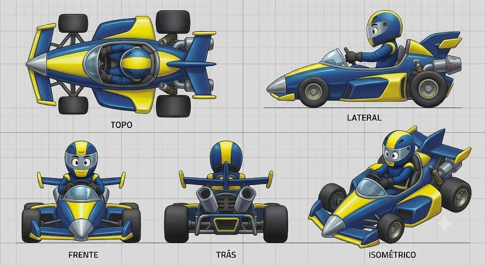

# Retro Rocket

## Descrição

Design que mistura a silhueta clássica dos karts de F1 dos anos 60 com cartunização exagerada. O corpo central é longo, fino e pontiagudo, como um foguete, enquanto as rodas ficam expostas em braços de suspensão comicamente grossos. O motor traseiro é maciço e centralizado, com leitura de turbina. O resultado combina elegância retrô e mecânica cartunesca.

## Vistas disponíveis

A imagem contém cinco painéis rotulados:

1. **Topo:** mostra o corpo-foguete central, cockpit aberto, piloto, rodas expostas, braços de suspensão largos, asas/barras dianteiras e traseiras e o motor traseiro central.
2. **Lateral:** mostra o nariz pontudo, cabine aberta com pequeno para-brisa, side pod, braços inferiores, rodas expostas, motor traseiro e escape/turbina.
3. **Frente:** mostra o cone central, para-brisa, piloto, eixo/barras dianteiras, rodas expostas e terminais amarelos das barras.
4. **Trás:** mostra o motor/turbina central, duas saídas de escape, grade inferior, barra traseira transversal, asas laterais e rodas traseiras expostas.
5. **Isométrico:** confirma a leitura de foguete retrô, com cabine aberta, rodas fora da carroceria, suspensão grossa e traseira mecânica dominante.

## Forma e proporção a preservar

- Corpo central longo, fino e pontiagudo, com leitura clara de foguete.
- Nariz cônico metálico/escuro, sem transformar o front-end em bumper de kart moderno.
- Cockpit aberto e central, com para-brisa curto e piloto visível.
- Rodas completamente expostas, fora da carroceria principal.
- Braços de suspensão deliberadamente grossos e visíveis, com terminais e suportes destacados.
- Pequenas asas/barras dianteiras e traseiras, com pontas amarelas e perfil fino.
- Side pods estreitos, fluidos e subordinados ao corpo central.
- Motor traseiro grande e centralizado, com aparência de turbina.
- Duas saídas de escape traseiras, grade inferior e suportes mecânicos visíveis.
- Piloto estilizado sentado no cockpit aberto, com capacete expressivo.

## Cor e material

### Customização permitida

As regiões **amarela** e **azul** são canais potenciais de customização de cor. A geometria, os limites dos painéis e a separação entre carroceria, suspensão e detalhes devem permanecer fiéis ao concept.

### Elementos que permanecem fiéis

- Pneus: pretos, expostos e com material emborrachado fosco.
- Braços de suspensão, eixos, suportes e ferragens: cinza metálico escuro/prata.
- Motor/turbina e escapes: cinza/prata metálico, com aberturas e tubos legíveis.
- Para-brisa: transparente ou fumê, curto e integrado ao cockpit aberto.
- Cone/nariz: manter o acabamento metálico/escuro representado no concept.
- Assento e cockpit interno: escuros.
- Rosto/olhos e visor do piloto: preservar a leitura cartunesca.
- Grid, textos dos painéis e linhas de chão não fazem parte do asset.

## Notas de modelagem

- Esta ficha é referência visual; não é autorização para iniciar modelagem.
- Não inferir dimensões exatas a partir do grid sem um briefing de escala.
- Amarelo e azul representam regiões de materialização/customização, não materiais finais obrigatórios.
- A proporção corpo-foguete → rodas expostas → suspensão grossa → turbina traseira é a identidade principal.
- Não esconder os braços de suspensão ou normalizar o veículo para uma carroceria fechada; a exposição mecânica é intencional.

## Arquivo-fonte

- `assets/retro-rocket.jpg`
- Arquivo recebido: `img_a52c942a0627.jpg`
