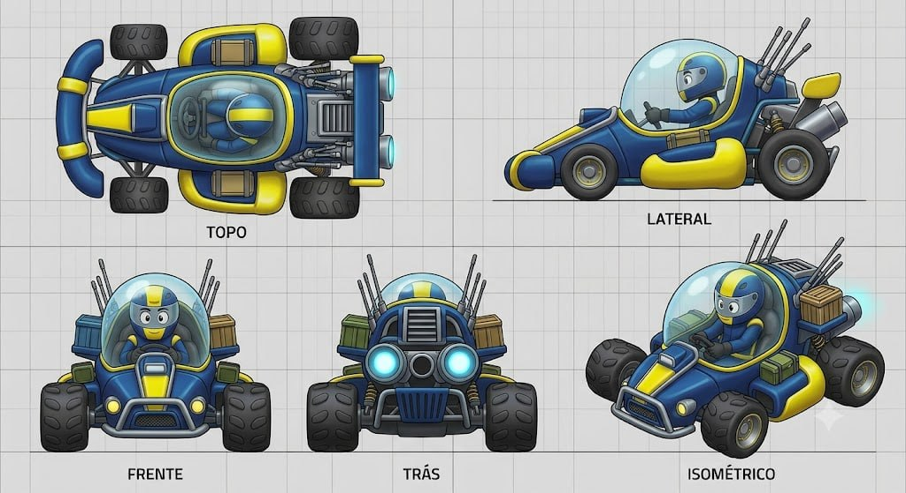

# Space Sweeper

## Descrição

Módulo cartunesco de coleta de lixo espacial adaptado para as pistas. O kart usa formas volumosas, assimétricas e utilitárias, com cockpit bolha grande e transparente, antenas cômicas, tanques laterais de sucata, caixas/contêineres e um grande módulo traseiro de fusão. A proposta é desajeitada, mas tecnologicamente exagerada.

## Vistas disponíveis

A imagem contém cinco painéis rotulados:

1. **Topo:** mostra o módulo central, a bolha grande, piloto, bumper frontal curvo, quatro rodas, tanques laterais, antenas e módulo traseiro.
2. **Lateral:** mostra o nariz utilitário, cockpit bolha dominante, piloto, side tank amarelo, caixas/tanques de sucata e o grande conjunto de fusão traseiro com tubos.
3. **Frente:** mostra a bolha e piloto centralizados, rodas largas, bumper/grade inferior, nariz e caixas laterais.
4. **Trás:** mostra o módulo de fusão central, duas luzes/saídas ciano, grade inferior, antenas, caixas e rodas traseiras.
5. **Isométrico:** confirma a assimetria utilitária, o cockpit superdimensionado, os tanques/caixas de sucata e a traseira tecnológica.

## Forma e proporção a preservar

- Volumes grossos, utilitários e ligeiramente assimétricos; não transformar em kart aerodinâmico limpo.
- Cockpit bolha muito grande e transparente, dominante na silhueta.
- Nariz curto com bumper/grade frontal curva.
- Antenas finas e cômicas saindo da região traseira/superior.
- Tanques laterais de sucata e caixas/contêineres montados externamente.
- Rodas grandes e robustas, com leitura de veículo de serviço.
- Módulo traseiro de fusão grande e centralizado, com tubos, grade e saídas luminosas.
- Piloto pequeno dentro da bolha, claramente protegido pelo canopy.

## Cor e material

### Customização permitida

Amarelo e azul são canais potenciais de customização. A geometria das carcaças, tanques, caixas e painéis deve permanecer fiel ao concept.

### Elementos que permanecem fiéis

- Pneus: pretos, largos e robustos.
- Cockpit: transparente/ciano claro, com brilho de vidro.
- Estrutura e ferragens: cinza metálico escuro.
- Módulo de fusão: escuro/metálico com luzes/saídas ciano luminosas.
- Antenas: finas, metálicas e visíveis.
- Caixas/contêineres de sucata: manter a leitura de peças utilitárias externas e materiais contrastantes do concept.
- Piloto: rosto/visor e traje cartunescos, protegido dentro da cabine.
- Grid, textos dos painéis e linhas de chão não fazem parte do asset.

## Notas de modelagem

- Esta ficha é referência visual; não é autorização para iniciar modelagem.
- Não inferir dimensões exatas a partir do grid sem um briefing de escala.
- Não limpar a assimetria nem remover tanques/caixas como “ruído”; a desorganização utilitária é a identidade.
- O cockpit bolha grande, as antenas, a sucata externa e o módulo de fusão são os elementos de maior prioridade.

## Arquivo-fonte

- `assets/space-sweeper.jpg`
- Arquivo recebido: `img_b517827f8a06.jpg`
