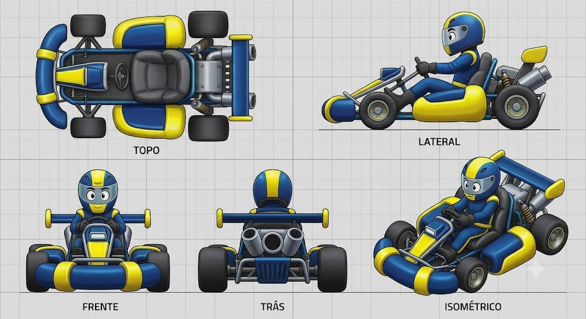

# The Bubble Bumper

## Descrição

Design de kart que abraça uma estética de **bolha amigável**, arredondada e inflada, com aparência de brinquedo premium. A carroceria privilegia volumes macios e grossos, um cockpit aberto, volante espesso e pneus grandes, lisos e desproporcionais.

## Vistas disponíveis

A imagem contém cinco vistas identificadas:

1. **Topo:** mostra a planta compacta, o bumper frontal largo, os quatro pneus grandes, o cockpit central aberto, o assento e o conjunto mecânico traseiro.
2. **Lateral:** mostra a linha baixa do kart, o cockpit aberto com piloto sentado, o side pod inflado, o bumper frontal, suspensão aparente, molas traseiras e escapes.
3. **Frente:** mostra o bumper tubular azul com segmentos amarelos, nariz central, pneus dianteiros largos, volante e piloto.
4. **Trás:** mostra a barra traseira, pneus traseiros, conjunto de escapes duplos, suspensão e grade/difusor central.
5. **Isométrico:** confirma a leitura tridimensional geral, a relação entre bumper, cockpit, side pods, piloto, pneus e mecânica traseira.

## Forma e proporção a preservar

- Silhueta geral baixa, larga, arredondada e amigável.
- Bumper frontal tubular, espesso e curvado, com duas extremidades elevadas; não substituir por uma lâmina fina ou para-choque retangular.
- Side pods grandes e inflados, envolvendo a região lateral do cockpit.
- Cockpit aberto, com assento escuro visível e volante grosso centralizado.
- Pneus deliberadamente grandes, largos, pretos e lisos; não adicionar tread agressivo sem novo briefing.
- Nariz frontal curto, arredondado e com pequeno painel/insert central.
- Traseira exposta, com barra horizontal, molas, braços de suspensão e dois escapes inclinados para fora.
- Piloto pequeno e estilizado, sentado dentro do cockpit; o concept mostra capacete fechado e macacão coordenado com a paleta do kart.

## Cor e material

### Customização permitida

As regiões **amarela** e **azul** devem ser tratadas como canais potenciais de customização de cor. A separação de peças, a cobertura visual e os limites das regiões devem permanecer fiéis ao concept mesmo quando a paleta for alterada.

### Elementos que permanecem fiéis

- Pneus: preto, lisos, com material emborrachado fosco.
- Assento e cockpit interno: preto/cinza-escuro, com leitura acolchoada.
- Chassi, suspensão e mecânica: cinza metálico escuro/prata, com molas e componentes expostos.
- Volante: aro escuro e espesso, com centro mecânico visível.
- Escapes: cinza metálico, dois tubos traseiros inclinados.
- Visor do capacete e detalhes escuros: manter leitura escura e refletiva conforme o concept.
- Fundo, grid e rótulos da imagem não fazem parte do asset.

## Notas de modelagem

- Esta ficha é referência visual; não é autorização para iniciar modelagem.
- Não inferir dimensões exatas a partir do grid da imagem sem um briefing de escala.
- O amarelo e o azul são regiões de materialização/customização, não necessariamente materiais finais.
- As cinco vistas devem ser consultadas juntas antes de definir qualquer geometria, principalmente o encaixe entre bumper frontal, side pods e mecânica traseira.

## Arquivo-fonte

- `assets/the-bubble-bumper.jpg`
- Arquivo recebido: `img_2fe9f71bd7c1.jpg`
