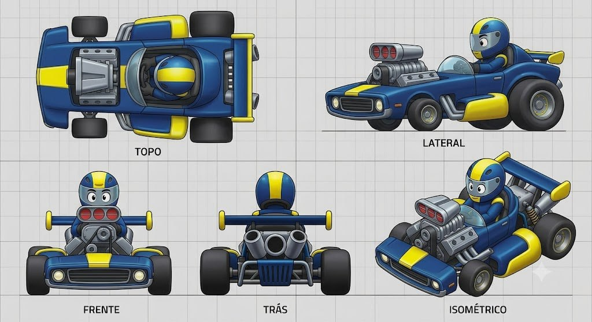

# The Muscle Muncher

## Descrição

Kart que exagera a silhueta de um muscle car clássico americano em proporções cômicas. O motor V8 ocupa grande parte da frente, com supercharger/filtros de ar duplos saindo do capô. O cockpit é pequeno em comparação, enquanto os pneus traseiros são muito largos, de dragster, e os dianteiros são pequenos. A linguagem é de torque e poder exagerado.

## Vistas disponíveis

A imagem contém cinco painéis rotulados:

1. **Topo:** mostra a carroceria longa, o motor frontal dominante, cockpit pequeno centralizado, pneus dianteiros pequenos, pneus traseiros largos, barras laterais e conjunto traseiro.
2. **Lateral:** mostra a frente de muscle car com grade e faróis redondos, supercharger elevado, cockpit minúsculo, side exhaust, side pod amarelo e enorme pneu traseiro.
3. **Frente:** mostra a grade horizontal, dois faróis, motor/supercharger central com três bocas vermelhas visíveis, eixo dianteiro com pneus pequenos e bumper largo.
4. **Trás:** mostra a barra/asa traseira, pneus dragster largos, módulo circular central, dois escapes traseiros e estrutura de suspensão.
5. **Isométrico:** confirma a hierarquia visual de motor gigante à frente, cockpit pequeno, carroceria baixa e traseira dominada pelos pneus.

## Forma e proporção a preservar

- Silhueta de muscle car clássico, baixa e comprida, com nariz largo.
- V8 visualmente gigantesco, ocupando aproximadamente metade da frente do kart.
- Supercharger/filtros de ar duplos elevados acima do capô, com bocas frontais vermelhas.
- Cockpit pequeno e recuado, proporcionalmente comprimido pelo motor.
- Pneus traseiros extremamente largos de dragster; pneus dianteiros pequenos e finos.
- Grade frontal horizontal larga, com dois faróis circulares claros.
- Side exhaust com tubos metálicos visíveis na lateral.
- Side pods/fenders arredondados envolvendo parcialmente as rodas.
- Barra/asa traseira atrás do piloto, com terminais amarelos e suportes visíveis.
- Traseira mecânica com módulo circular central, dois escapes inclinados e grade inferior.
- Piloto estilizado pequeno, sentado atrás do motor e com capacete expressivo.

## Cor e material

### Customização permitida

As regiões **amarela** e **azul** são canais potenciais de customização de cor. A geometria, a distribuição de painéis e os limites dessas regiões devem permanecer fiéis ao concept.

### Elementos que permanecem fiéis

- Pneus: borracha preta; traseiros muito largos e dianteiros pequenos.
- Motor V8, supercharger, filtros e ferragens: cinza/prata metálico.
- Bocas do supercharger: vermelhas, preservando a leitura de entradas de ar.
- Grade e chassi: escuros/metálicos, com grade frontal horizontal.
- Faróis: claros e circulares.
- Side exhaust e escapes traseiros: tubos metálicos prateados.
- Cockpit/assento: escuros e comprimidos atrás do motor.
- Suspensão, barras e suportes: metálicos, visíveis e funcionais.
- Rosto/olhos e visor do piloto: preservar a leitura cartunesca expressiva.
- Grid, textos dos painéis e linhas de chão não fazem parte do asset.

## Notas de modelagem

- Esta ficha é referência visual; não é autorização para iniciar modelagem.
- Não inferir dimensões exatas a partir do grid sem um briefing de escala.
- Amarelo e azul representam regiões de materialização/customização, não materiais finais obrigatórios.
- A proporção motor gigante → cockpit pequeno → pneus traseiros dragster é a identidade principal e deve ser validada nas cinco vistas.
- Não normalizar as proporções para um kart convencional; a exageração de torque é intencional.

## Arquivo-fonte

- `assets/the-muscle-muncher.jpg`
- Arquivo recebido: `img_0286a5cf2844.jpg`
